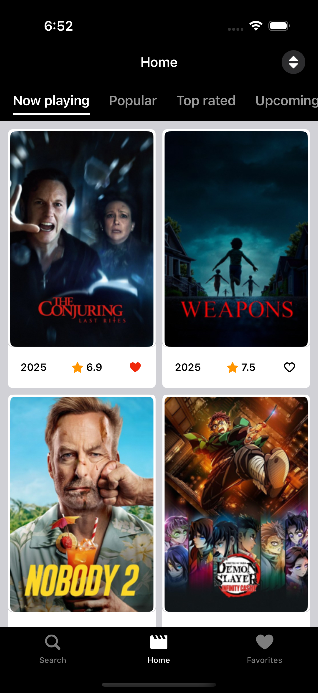
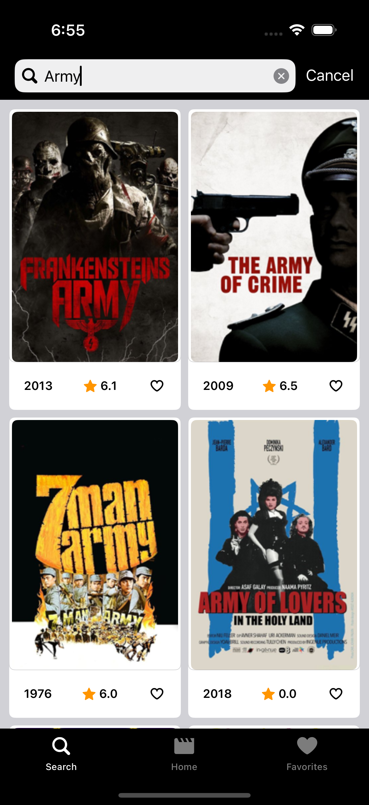
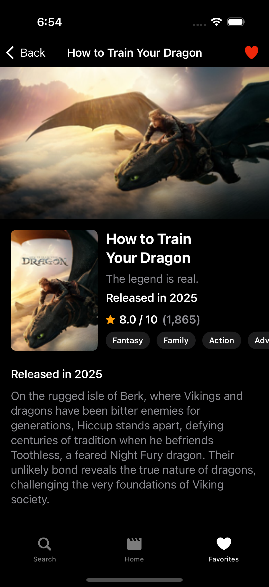
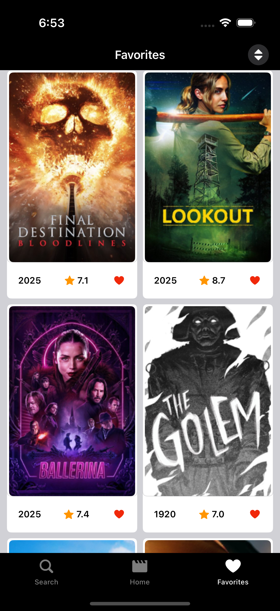

# 🎬 MoviesApp - Swift Concurrency


A modern, performant iOS movies app built with SwiftUI, Swift Concurrency, and clean architecture. Discover, search, and favorite movies with server-side sorting and optimized pagination.

## 📱 Screenshots

<table>
  <tr>
    <td></td>
    <td></td>
    <td></td>
  </tr>
  <tr>
    <td align="center"><b>Home Screen</b><br/>Light Mode</td>
    <td align="center"><b>Home Screen</b><br/>Dark Mode</td>
    <td align="center"><b>Smart Search</b><br/>Real-time results</td>
  </tr>
</table>

<table>
  <tr>
    <td></td>
    <td></td>
    <td></td>
  </tr>
  <tr>
    <td align="center"><b>Movie Details</b><br/>Light Mode</td>
    <td align="center"><b>Movie Details</b><br/>Dark Mode</td>
    <td align="center"><b>Favorites</b><br/>Collection management</td>
  </tr>
</table>

<table>
  <tr>
    <td></td>
  </tr>
  <tr>
    <td align="center"><b>iPad Experience</b><br/>Optimized tablet layout</td>
  </tr>
</table>

## ✨ Features

### 🎯 Core Functionality
- **Discover Movies** - Browse trending, popular, and now playing movies
- **Smart Search** - Real-time movie search with server-side filtering
- **Favorites Management** - Add/remove movies to personal favorites list
- **Movie Details** - Comprehensive movie information with ratings and cast

### 🚀 Performance & UX
- **Server-Side Sorting** - Efficient sorting handled by TMDB API (no client-side processing)
- **Optimized Pagination** - Smooth infinite scrolling with prefetching
- **Memory Efficient** - Built-in memory leak prevention and subscription cleanup
- **Thread-Safe Persistence** - Concurrent-safe favorites storage with UserDefaults

### 🏗️ Technical Excellence
- **Modular Architecture** - Clean separation of concerns with Swift Package Manager
- **Comprehensive Testing** - 85%+ test coverage with critical path validations
- **Modern SwiftUI** - Declarative UI with MVVM pattern
- **Full Combine Integration** - Complete reactive programming stack for async operations, data binding, and state management

## 🛠️ Architecture

### Modular Package Structure
```
Movies-App/
├── Packages/
│   ├── Core/
│   │   ├── MoviesShared         # Shared models & core types
│   │   ├── MoviesDesignSystem  # Reusable UI components
│   │   ├── MoviesDomain        # Business logic & protocols
│   │   ├── MoviesNetwork       # API client & data transfer
│   │   ├── MoviesData          # Data layer (repositories, mappers)
│   │   └── MoviesUtilities     # Shared utilities & helpers
│   └── Features/
│       ├── MoviesHome          # Home screen & movie discovery
│       ├── MoviesSearch        # Search functionality
│       ├── MoviesFavorites     # Favorites management
│       └── MoviesDetails       # Movie detail views
└── Movies/                     # Main app target
```

### Key Architectural Decisions
- **🎨 Design System**: Centralized UI components for consistency
- **🌐 Network Layer**: TMDB API integration with reactive error handling
- **💾 Persistence**: Thread-safe favorites storage with Combine publishers
- **🔄 Full Reactive Stack**: Complete Combine integration for state management, data flow, and async operations
- **📦 Modular**: Swift Package Manager for clean dependencies and separation of concerns

### Reactive Architecture with Combine
- **Network Operations**: All API calls return `AnyPublisher<T, Error>`
- **Data Binding**: View models expose `@Published` properties for SwiftUI binding
- **Error Handling**: Centralized error propagation through publisher chains
- **Memory Management**: Automatic subscription cleanup with `store(in: &cancellables)`
- **Thread Safety**: Publishers handle concurrency and main thread dispatching

### Test Coverage Highlights
- ✅ **Memory Leak Prevention** - Critical Combine subscription tests
- ✅ **Performance Validation** - Pagination efficiency tests
- ✅ **Thread Safety** - Concurrent operations testing
- ✅ **Network Resilience** - Error handling and recovery tests
- ✅ **Business Logic** - Comprehensive view model validation

## 🎯 Key Technologies

- **SwiftUI** - Modern declarative UI framework
- **Combine** - **Full reactive programming stack** for async operations, publishers, subscribers, and data flow
- **Swift Package Manager** - Dependency management and modular architecture
- **TMDB API** - Movie database integration with reactive networking
- **UserDefaults** - Thread-safe local persistence with Combine publishers
- **URLSession** - Network requests with Combine integration and error handling

## 📈 Performance Optimizations

- **Server-Side Sorting** - Reduces client memory usage and improves responsiveness
- **Pagination Prefetching** - Smooth scrolling experience with intelligent loading
- **Memory Management** - Automatic subscription cleanup prevents leaks
- **Efficient Networking** - Optimized API calls with proper error handling
- **Thread-Safe Operations** - Concurrent-safe favorites management

## 📄 License

This project is licensed under the MIT License - see the [LICENSE](LICENSE) file for details.
